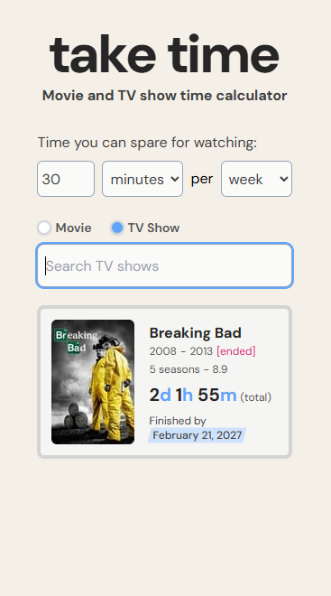

# Taketime: movie and TV show time calculator

A web app that helps you calculate how long it will take to binge a show, based on your available watch time.

  

## ✨ Features

- Users can set their _daily_, _weekly_, or _monthly_ viewing time for movies or TV shows.
- Users can choose between _movies_ or _TV shows_, including series, anime, and other formats (talk shows, talent shows, makeovers, etc.).
- The time calculator gives users two outputs: the whole duration of the show, and the estimated end date based on the chosen viewing time.
- Some additional details about the movie or the TV show are also visible, such as the release year, number of seasons and rating.

## 🧰 Tech stack

- The Movie Database (TMDB) API
- React and ReactDOM
- TanStack Query React
- Preact signals
- Tailwind CSS
